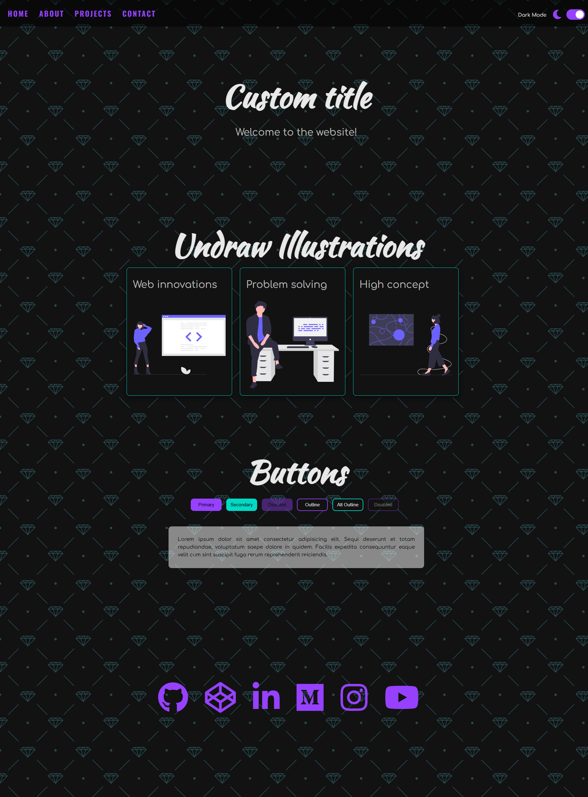
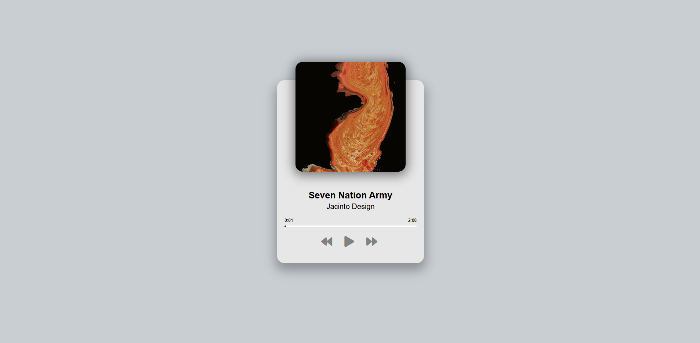
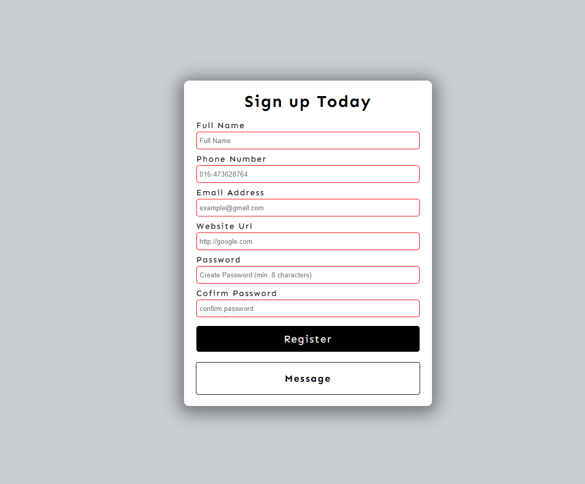
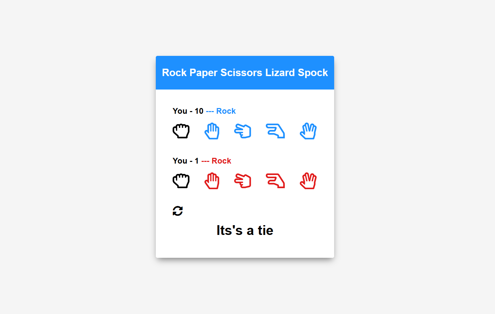
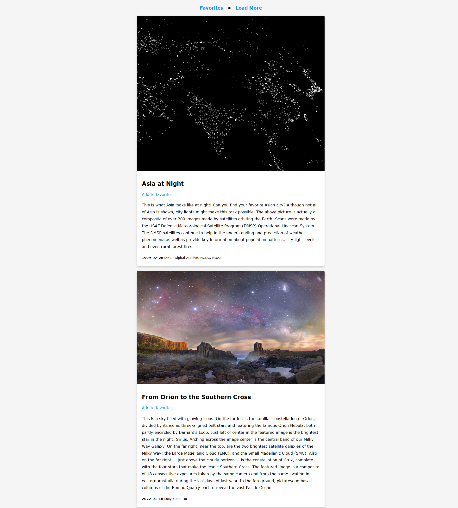
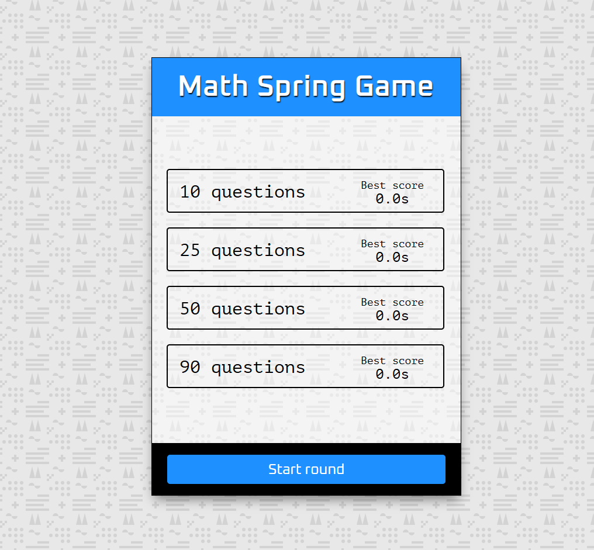
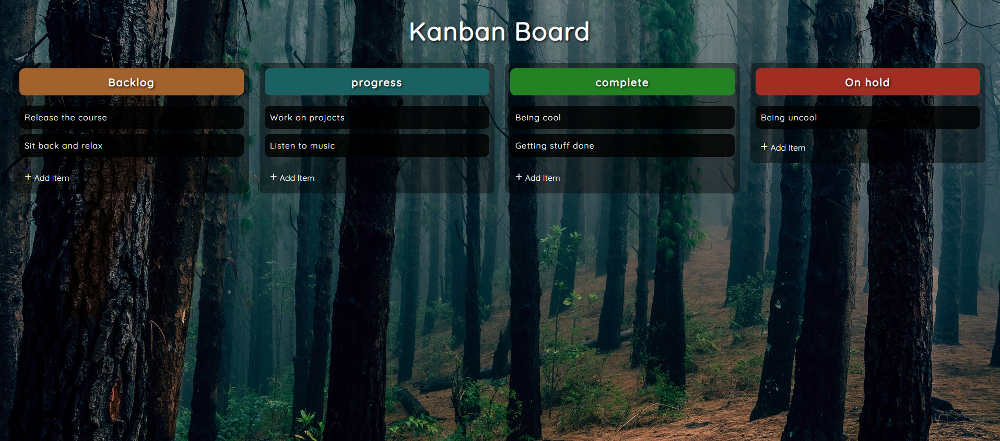
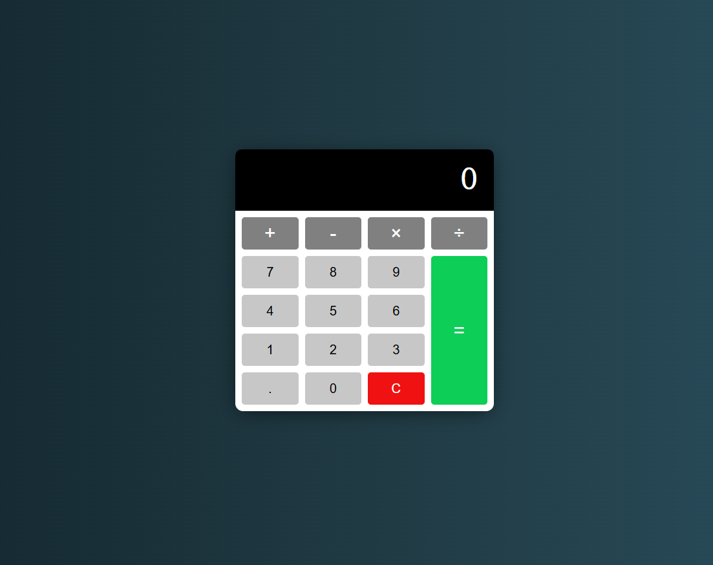

# 20 JavaScript Web Projects: Portfolio

This repository tracks my journey through the **"20 JavaScript Web Projects"** course. Each project is built with Vanilla JS, focusing on high-performance DOM manipulation and modern API integration.

---

## Project Links

_Use this table for quick navigation to the live demos, code, and detailed gallery sections._

| #   | Project Name            | Status |                        Live Demo                         |                Details                |
| :-- | :---------------------- | :----: | :------------------------------------------------------: | :-----------------------------------: |
| 01  | **Quote Generator**     |   ✅   |     [Live ](https://quote-generato-web.netlify.app/)     |   [Read more ](#01-quote-generator)   |
| 02  | **Infinite Scroll**     |   ✅   |      [Live ](https://infinite-scrool.netlify.app/)       |   [Read more ](#02-infinite-scroll)   |
| 03  | **Picture-in-Picture**  |   ✅   |   [Live ](https://picture-in-picture-web.netlify.app/)   | [Read more ](#03-picture-in-picture)  |
| 04  | **Joke Teller**         |   ✅   |      [Live ](https://joke-teller-web.netlify.app/)       |     [Read more ](#04-joke-teller)     |
| 05  | **Light/Dark Mode**     |   ✅   |    [Live ](https://light-dark-mode-web.netlify.app/)     |   [Read more ](#05-lightdark-mode)    |
| 06  | **Animated Template**   |   ✅   |     [Live ](https://template-animated.netlify.app/)      |  [Read more ](#06-animated-template)  |
| 07  | **Navigation Nation**   |   ✅   |   [Live ](https://navigation-nation-web.netlify.app/)    |  [Read more ](#07-navigation-nation)  |
| 08  | **Music Player**        |   ✅   |    [Live ](https://web-music-player-app.netlify.app/)    |    [Read more ](#08-music-player)     |
| 09  | **Custom Countdown**    |   ✅   |   [Live ](https://custom-count-down-web.netlify.app/)    |  [Read more ](#09-custom-countdown)   |
| 10  | **Book Keeper**         |   ✅   |      [Live ](https://book-keeper-web.netlify.app/)       |     [Read more ](#10-book-keeper)     |
| 11  | **Video Player**        |   ✅   | [Live ](https://custom-video-player-webapp.netlify.app/) |    [Read more ](#11-video-player)     |
| 12  | **Form Validator**      |   ✅   |     [Live ](https://form-validator-web.netlify.app/)     |   [Read more ](#12-form-validator)    |
| 13  | **Spock Rock Game**     |   ✅   |       [Live ](https://spock-rock-web.netlify.app/)       |   [Read more ](#13-spock-rock-game)   |
| 14  | **NASA APOD**           |   ✅   |     [Live ](https://nasa-apod-web-app.netlify.app/)      |      [Read more ](#14-nasa-apod)      |
| 15  | **Math Sprinting Game** |   ✅   |       [Live ](https://math-sprinting.netlify.app/)       | [Read more ](#15-math-sprinting-game) |
| 16  | **Drag and Drop**       |   ✅   |      [Live ](https://drag-n-drop-web.netlify.app/)       |    [Read more ](#16-drag-and-drop)    |
| 17  | **Calculator**          |   ✅   |    [Live ](https://calculator-webapp-1.netlify.app/)     |     [Read more ](#17-calculator)      |
| 18  | **Splash Page**         |   ⏳   |                        _Pending_                         |                   -                   |

---

## Project Gallery

_Detailed look at each project with high-resolution screenshots._

### 01. Quote Generator

Built a dynamic quote engine that fetches data from a REST API and features custom social sharing.

**Key Learnings:**

- Implementing a "Loading Spinner" to improve UX during API calls.
- Using the Twitter Intent API to share text dynamically.
- Logic to handle "Long Quotes" by shrinking the font size automatically.

---

### 02. Infinite Scroll

Created a seamless image browsing experience similar to Pinterest, powered by the Unsplash API.

**Key Learnings:**

- Efficiently managing network requests using `async/await`.
- Calculating scroll position logic: `window.innerHeight + window.scrollY >= document.body.offsetHeight - 1000`.
- Creating a custom "Loader" that disappears only after the images have fully rendered.

---

### 03. Picture-in-Picture

Developed a utility that allows users to select a video stream and display it in a floating "always-on-top" window.

**Key Learnings:**

- **Screen Capture API:** Using `navigator.mediaDevices.getDisplayMedia()` to capture screen video.
- **Picture-in-Picture API:** Triggering `requestPictureInPicture()` to detach the video window from the browser.

---

### 04. Joke Teller

An interactive app that fetches jokes and uses a Text-to-Speech API to read them aloud, featuring a custom-designed robot character.

**Key Learnings:**

- **VoiceRSS API:** Integrating a Text-to-Speech SDK to convert string data into spoken audio.
- **API Coordination:** Fetching data from the Joke API and passing the resulting string into the Voice function.
- **UI State Management:** Disabling the "Tell Me A Joke" button while the audio is playing to prevent overlapping speech and API spam.

---

### 05. Light/Dark Mode

A highly practical project focusing on UI customization and data persistence. This app allows users to toggle between light and dark themes with the setting being remembered even after a page refresh.

**Key Learnings:**

- **LocalStorage API:** Using `localStorage.setItem()` and `getItem()` to save the user's preference in the browser's local memory.
- **Data Attributes:** Dynamically updating the `data-theme` attribute on the `document.documentElement` to trigger CSS variable shifts.
- **CSS Variables:** Mastering `:root` variables to create a clean, maintainable theme-switching system.
- **Conditional Logic:** Writing a "Switch Theme" function that updates icons, text, and image assets simultaneously based on the toggle state.

---

### 06. Animated Template

A high-quality, responsive landing page featuring modern entrance animations that trigger as the user scrolls down the page. This project focuses on the intersection of JavaScript logic and CSS design.

**Key Learnings:**

- **On-Scroll Animations:** Implementing logic to trigger CSS animations exactly when elements enter the viewport.
- **AOS (Animate On Scroll) Library:** Integrating and customizing a professional animation library to manage complex transition timings.
- **UX Design Principles:** Balancing movement and speed to ensure animations enhance the site experience without distracting the user.

---

### 07. Navigation Nation

A sleek, full-screen overlay navigation menu with staggered entrance animations. This project demonstrates how to coordinate complex CSS transitions using JavaScript class manipulation.

**Key Learnings:**

- **CSS Staggered Animations:** Applying incremental delays to list items so they appear one by one for a polished UI feel.
- **Class Manipulation:** Efficiently using `classList.replace()`, `add()`, and `remove()` to toggle navigation states between "slide-in" and "slide-out."
- **Overlay Logic:** Creating a responsive, mobile-friendly navigation overlay that doesn't interfere with the main page content when closed.
- **Dry Code (DRY):** Writing a reusable `toggleNav()` function to handle all animation logic in one place.

---

### 08. Music Player

A fully functional custom audio player featuring play/pause, next/previous track functionality, and an interactive progress bar. This project focuses on the HTML5 Audio API and real-time DOM updates.

**Key Learnings:**

- **HTML5 Audio API:** Mastering properties like `audio.play()`, `audio.pause()`, and tracking `currentTime` and `duration`.
- **Progress Bar Math:** Calculating the percentage of the song played to update the width of the progress bar: `(currentTime / duration) * 100`.
- **Interactive Seeking:** Implementing logic to allow users to click anywhere on the progress bar to jump to a specific part of the song using `e.offsetX`.
- **Dynamic Content:** Loading song metadata (titles, artists, and covers) from an array of objects to keep the code modular and easy to scale.
- **Event Listeners:** Utilizing the `timeupdate` event for smooth UI updates and the `ended` event to automatically trigger the next track.

---

### 09. Custom Countdown

A specialized tool that allows users to set a target date and track the remaining time down to the second. This project emphasizes date manipulation and state persistence.

**Key Learnings:**

- **Date Object & Math:** Converting raw milliseconds into readable days, hours, minutes, and seconds using math constants.
- **Time Management:** Using `setInterval()` to update the UI every second and `clearInterval()` to stop the process when the countdown finishes or is reset.
- **Input Validation:** Setting a `min` attribute on the HTML5 Date input dynamically to prevent users from selecting past dates.
- **Persistent States:** Storing the countdown title and date in `localStorage` so the countdown continues even after a page refresh.
- **UI Switching:** Managing three distinct UI states (Input form, Active countdown, and Finished message) by toggling the `hidden` attribute.

---

### 10. Book Keeper

A bookmark management application that allows users to save, display, and delete website shortcuts. This project focuses on data structure management and form processing.

**Key Learnings:**

- **Modal Logic:** Creating a functional popup overlay for data entry using DOM manipulation and CSS visibility toggles.
- **RegEx Validation:** Implementing Regular Expressions to ensure users enter valid URLs before the form can be submitted.
- **LocalStorage Arrays:** Saving bookmarks as an array of objects and using `JSON.stringify()` and `JSON.parse()` for data persistence.
- **Event Delegation:** Efficiently handling delete clicks on dynamically generated elements by attaching listeners to a parent container.
- **Template Literals:** Using JavaScript to generate and inject complex HTML structures into the DOM based on user-stored data.

---

### 11. Video Player

Developed a custom HTML5 Video Player with a bespoke interface, featuring playback speed control, progress bar seeking, and volume management.

**Key Learnings:**

- **HTML5 Video API:** Utilizing methods like `video.play()`, `video.pause()`, and properties like `video.paused` and `video.currentTime`.
- **Custom UI Controls:** Building a unique control bar with JavaScript to handle volume, playback speed, and time display.
- **Progress Bar Interactivity:** Calculating the click position on the progress bar to update the video's `currentTime` proportionally.
- **Playback Rate:** Dynamically adjusting the `playbackRate` property (e.g., 0.5x, 1x, 2x) via a dropdown menu.
- **Fullscreen API:** Implementing cross-browser logic to toggle full-screen mode for a better viewing experience.

---

### 12. Form Validator

A robust registration form that provides real-time validation and styling to guide users toward correct data entry. This project focuses on input security and user experience.

**Key Learnings:**

- **Input Logic:** Creating a reusable `showError` and `showSuccess` function to manipulate CSS classes and error messages dynamically.
- **Length Validation:** Implementing checks to ensure usernames and passwords meet specific character length requirements.
- **Password Matching:** Writing logic to compare the "Password" and "Confirm Password" fields to ensure they are identical.
- **Email RegEx:** Using standard Regular Expressions to validate email formats on the client side.
- **Event Coordination:** Utilizing the `submit` event to prevent default behavior until all fields pass the validation suite.

---

### 13. Spock Rock Game

An expanded version of Rock Paper Scissors that includes Lizard and Spock. This project focuses on handling complex conditional logic and integrating external animations.

**Key Learnings:**

- **Game Logic Architecture:** Using an object-based lookup system or complex nested conditionals to determine winners among 5 different choices.
- **External Modules:** Implementing the `confetti-js` library to provide visual rewards when the player wins.
- **Dynamic Styling:** Toggling CSS classes to highlight selections for both the player and the computer while resetting previous states.
- **Randomization:** Generating computer choices using `Math.random()` and mapping results to specific game elements.

---

### 14. NASA APOD

An interactive dashboard that fetches NASA's "Astronomy Picture of the Day." This project emphasizes data fetching, favorite management, and dynamic DOM updates.

**Key Learnings:**

- **NASA API Integration:** Fetching high-definition media and metadata from a secure government API endpoint.
- **Favorites System:** Implementing logic to "Save" and "Remove" specific images from a favorites list, stored locally.
- **LocalStorage Management:** Persisting the favorites array as JSON to ensure user data remains after a refresh.
- **Dynamic DOM Generation:** Using `forEach` to iterate through API results and generate complex HTML cards on the fly.
- **Conditional Rendering:** Handling different media types (Images vs. Videos) and adjusting the UI accordingly.

---

### 15. Math Sprinting Game

A fast-paced arithmetic game that challenges users to solve equations against the clock. This project focuses on performance tracking, high-score persistence, and precise UI timing.

**Key Learnings:**

- **Dynamic Equation Generation:** Writing logic to create random addition, subtraction, and multiplication equations, intentionally mixing in incorrect results for the user to identify.
- **State Management:** Seamlessly transitioning between 4 distinct game UI states (Splash, Countdown, Game, and Score) by toggling the `hidden` attribute.
- **Timer Precision:** Using `setInterval` to track player time down to a single decimal point and calculating penalty time for wrong answers.
- **High Scores:** Storing and retrieving personal bests from `localStorage` based on the selected number of questions (10, 25, 50, or 99).
- **DOM Efficiency:** Manipulating the `scrollTop` property to auto-scroll the equation list as the user plays.

---

### 16. Drag and Drop

A custom Kanban board that allows users to organize tasks across multiple columns using native browser capabilities. This project focuses on the Drag and Drop API and complex data state synchronization.

**Key Learnings:**

- **HTML5 Drag and Drop API:** Mastering event listeners like `dragstart`, `dragenter`, `dragover`, and `drop` to facilitate smooth item movement.
- **Data Transfer:** Using JavaScript to track which item is being dragged and which column it belongs to during the transition.
- **Rebuilding the DOM:** Writing a `rebuildArrays` function to scrape the current DOM state and update the underlying JavaScript arrays to reflect user changes.
- **Persistence:** Ensuring that every drag-and-drop action triggers a `localStorage` save so the board remains exactly as the user left it.
- **UI Feedback:** Dynamically adding and removing CSS classes (like `over` or `dragging`) to provide visual cues to the user during the interaction.

---

### 17. Calculator

A sleek, fully functional web calculator built with a focus on logic flow and floating-point precision. This project demonstrates complex state management without external libraries.

**Key Learnings:**

- **Operator Logic:** Managing the transition between values when an operator (+, -, \*, /) is pressed, including the ability to chain operations.
- **Decimal Management:** Implementing checks to ensure only one decimal point can be added per number.
- **Display Formatting:** Updating the DOM in real-time to show current inputs and results while handling overflow for large numbers.
- **Clear Logic:** Differentiating between a "Clear" (resets current value) and "All Clear" (resets entire memory state).
- **Math Object:** Leveraging JavaScript's built-in math capabilities to ensure accurate result processing for complex operations.

---

### 18. Splash Page (Coming Soon)

_Placeholder for the upcoming project logic and screenshot._

---

## Tech & Tools

- **Languages:** HTML5, CSS3, JavaScript (ES6+)
- **APIs & Libraries:** NASA API, Unsplash, Quote API, Screen Capture, VoiceRSS, AOS Library, HTML5 Audio API, HTML5 Video API, Confetti.js
- **Key Concepts:** DOM Manipulation, Local Storage, Async/Await, CSS Variables, Scroll-based Events, Staggered Animations, Audio/Video Manipulation, Date & Time Math, RegEx Validation, Modal UI, Fullscreen API, Form Validation, Game Logic, Persistent Favorites, State Management, Timer Logic, Drag and Drop API, Floating Point Arithmetic
- **Environment:** VS Code, Git, Netlify (Hosting)

## How to Run Locally

1. Clone this repo:
   `https://github.com/Sobuj54/JavaScript-Projects.git`
2. Each folder is a standalone project. Simply open the `index.html` file using **Live Server**.
