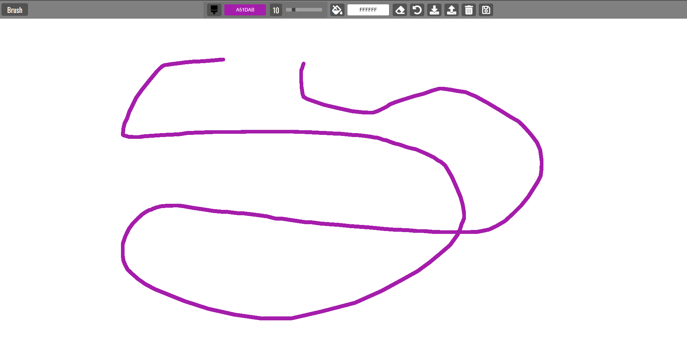
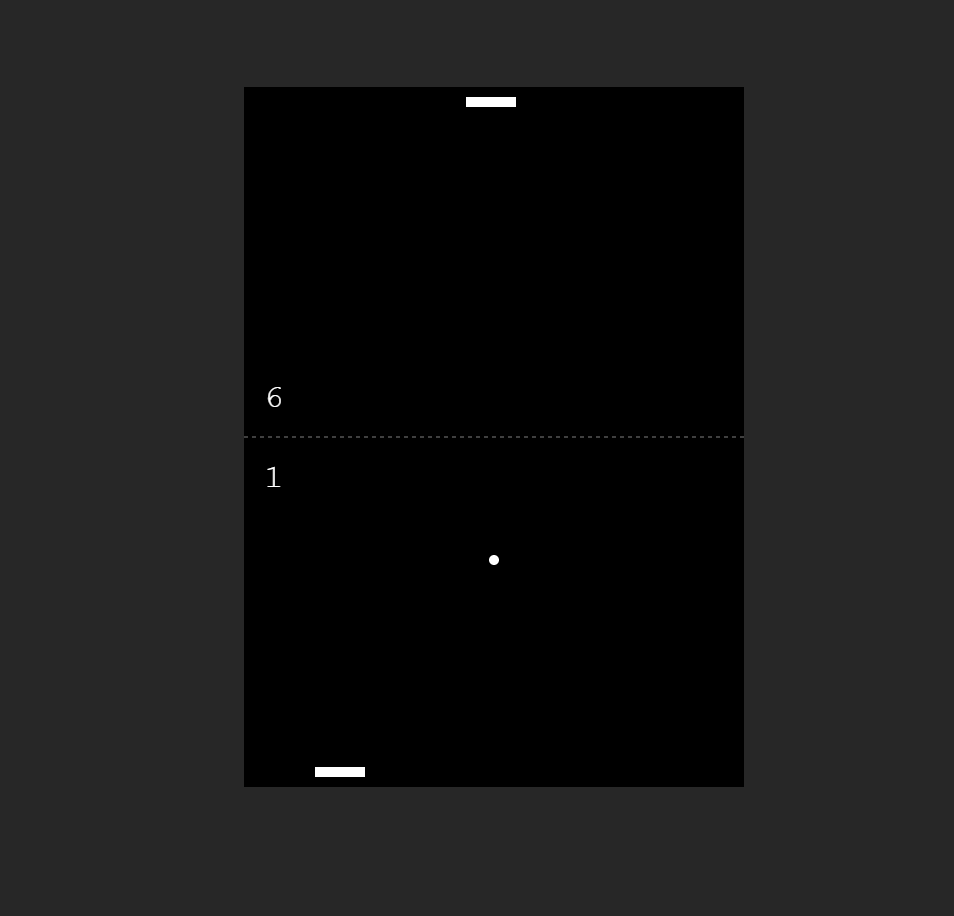

# 20 JavaScript Web Projects: Portfolio

This repository tracks my journey through the **"20 JavaScript Web Projects"** course. Each project is built with Vanilla JS, focusing on high-performance DOM manipulation and modern API integration.

---

## Project Links

_Use this table for quick navigation to the live demos, code, and detailed gallery sections._

| #   | Project Name            | Status |                        Live Demo                         |                Details                |
| :-- | :---------------------- | :----: | :------------------------------------------------------: | :-----------------------------------: |
| 01  | **Quote Generator**     |   ✅   |     [Live ](https://quote-generato-web.netlify.app/)     |   [Read more ](#01-quote-generator)   |
| 02  | **Infinite Scroll**     |   ✅   |      [Live ](https://infinite-scrool.netlify.app/)       |   [Read more ](#02-infinite-scroll)   |
| 03  | **Picture-in-Picture**  |   ✅   |   [Live ](https://picture-in-picture-web.netlify.app/)   | [Read more ](#03-picture-in-picture)  |
| 04  | **Joke Teller**         |   ✅   |      [Live ](https://joke-teller-web.netlify.app/)       |     [Read more ](#04-joke-teller)     |
| 05  | **Light/Dark Mode**     |   ✅   |    [Live ](https://light-dark-mode-web.netlify.app/)     |   [Read more ](#05-lightdark-mode)    |
| 06  | **Animated Template**   |   ✅   |     [Live ](https://template-animated.netlify.app/)      |  [Read more ](#06-animated-template)  |
| 07  | **Navigation Nation**   |   ✅   |   [Live ](https://navigation-nation-web.netlify.app/)    |  [Read more ](#07-navigation-nation)  |
| 08  | **Music Player**        |   ✅   |    [Live ](https://web-music-player-app.netlify.app/)    |    [Read more ](#08-music-player)     |
| 09  | **Custom Countdown**    |   ✅   |   [Live ](https://custom-count-down-web.netlify.app/)    |  [Read more ](#09-custom-countdown)   |
| 10  | **Book Keeper**         |   ✅   |      [Live ](https://book-keeper-web.netlify.app/)       |     [Read more ](#10-book-keeper)     |
| 11  | **Video Player**        |   ✅   | [Live ](https://custom-video-player-webapp.netlify.app/) |    [Read more ](#11-video-player)     |
| 12  | **Form Validator**      |   ✅   |     [Live ](https://form-validator-web.netlify.app/)     |   [Read more ](#12-form-validator)    |
| 13  | **Spock Rock Game**     |   ✅   |       [Live ](https://spock-rock-web.netlify.app/)       |   [Read more ](#13-spock-rock-game)   |
| 14  | **NASA APOD**           |   ✅   |     [Live ](https://nasa-apod-web-app.netlify.app/)      |      [Read more ](#14-nasa-apod)      |
| 15  | **Math Sprinting Game** |   ✅   |       [Live ](https://math-sprinting.netlify.app/)       | [Read more ](#15-math-sprinting-game) |
| 16  | **Drag and Drop**       |   ✅   |      [Live ](https://drag-n-drop-web.netlify.app/)       |    [Read more ](#16-drag-and-drop)    |
| 17  | **Calculator**          |   ✅   |    [Live ](https://calculator-webapp-1.netlify.app/)     |     [Read more ](#17-calculator)      |
| 18  | **Splash Page**         |   ✅   |      [Live ](https://splash-page-web.netlify.app/)       |     [Read more ](#18-splash-page)     |
| 19  | **Paint Clone**         |   ✅   |      [Live ](https://paint-clone-web.netlify.app/)       |     [Read more ](#19-paint-clone)     |
| 20  | **Pong**                |   ✅   |       [Live ](https://pong-game-web.netlify.app/)        |        [Read more ](#20-pong)         |

---

## Project Gallery

_Detailed look at each project with high-resolution screenshots._

### 01. Quote Generator

Built a dynamic quote engine that fetches data from a REST API and features custom social sharing.

**Key Learnings:**

- Implementing a "Loading Spinner" to improve UX during API calls.
- Using the Twitter Intent API to share text dynamically.
- Logic to handle "Long Quotes" by shrinking the font size automatically.

---

### ... (Projects 02 - 18 omitted for brevity, but remain unchanged) ...

---

### 19. Paint Clone

A fully functional drawing application built using the HTML5 Canvas API. This project focuses on pixel-based rendering and interactive graphical user interfaces.

**Key Learnings:**

- **HTML5 Canvas API:** Mastering the `canvas.getContext('2d')` to draw paths, shapes, and manage brush settings like `lineWidth` and `strokeStyle`.
- **Mouse Event Coordination:** Tracking `mousedown`, `mousemove`, and `mouseup` to enable fluid free-hand drawing.
- **Canvas Math:** Calculating cursor offsets relative to the canvas container to ensure high drawing precision.
- **Functional Tools:** Implementing specialized logic for an Eraser, Color Picker, and Brush size slider.
- **Storage & Retrieval:** Using `canvas.toDataURL()` to save the masterpiece or storing path arrays in `localStorage` to persist drawings after refresh.

---

### 20. Pong

A classic arcade game reconstruction featuring high-performance canvas animations and a computer-controlled opponent. This final project serves as a masterclass in game logic and physics.

**Key Learnings:**

- **Canvas Rendering Loop:** Using `requestAnimationFrame()` to create a high-performance, 60FPS animation loop for smooth movement.
- **2D Collision Detection:** Implementing geometric logic to detect ball contact with paddles, top/bottom walls, and tracking "out of bounds" for scoring.
- **Computer AI Logic:** Writing a paddle-tracking algorithm that follows the ball's Y-coordinate with adjustable difficulty to challenge the player.
- **Dynamic Scoring:** Managing real-time state updates to track points, reset the ball after a goal, and display the final winner.
- **Responsive Canvas:** Adjusting coordinate math to ensure the game remains playable across different screen sizes.

---

## Tech & Tools

- **Languages:** HTML5, CSS3, JavaScript (ES6+)
- **APIs & Libraries:** NASA API, Unsplash, Quote API, Screen Capture, VoiceRSS, AOS Library, HTML5 Audio API, HTML5 Video API, Confetti.js
- **Key Concepts:** DOM Manipulation, Local Storage, Async/Await, CSS Variables, Scroll-based Events, Staggered Animations, Audio/Video Manipulation, Date & Time Math, RegEx Validation, Modal UI, Fullscreen API, Form Validation, Game Logic, Persistent Favorites, State Management, Timer Logic, Drag and Drop API, Floating Point Arithmetic, Dynamic Class Switching, HTML5 Canvas API, requestAnimationFrame, 2D Collision Physics.
- **Environment:** VS Code, Git, Netlify (Hosting)

## How to Run Locally

1. Clone this repo:
   `https://github.com/Sobuj54/JavaScript-Projects.git`
2. Each folder is a standalone project. Simply open the `index.html` file using **Live Server**.
